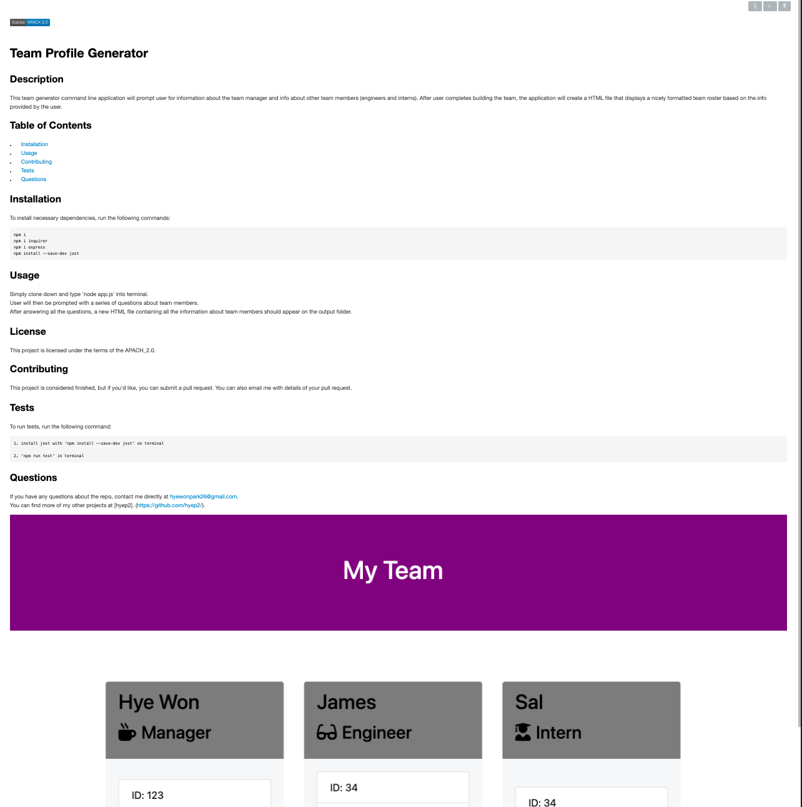

# 
  
# README Generator 

## Description

The purpose of this command line application is to generate a README for any project.

## Table of Contents
* [Installation](#installation)
* [Usage](#usage)
* [Contributing](#contributing)
* [Tests](#tests)
* [Questions](#questions)

## Installation

To install necessary dependencies, run the following commands: 

```
npm i, npm i inquirer
```

## Usage

Simply clone down and type 'node index.js' into terminal to be prompted with a series of questions regarding your project

## License

This project is licensed under the terms of the APACH_2.0.

## Contributing

Simply clone down and type 'node index.js' into terminal to be prompted with a series of questions regarding your project.


## Questions

If you have any questions about the repo, contact me directly at hyewonpark26@gmail.com.
You can find more of my other projects at [hyep2]. (https://github.com/hyep2/).

## Display of Project

